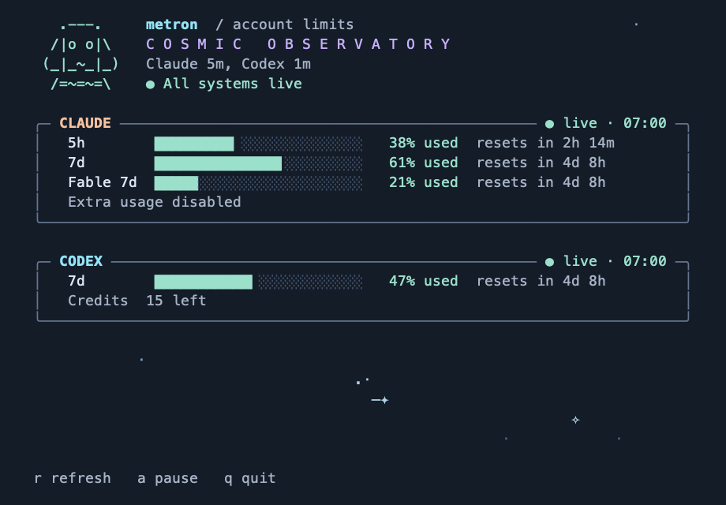

# Metron

A compact terminal dashboard for your Claude and Codex account limits.
Named after DC's Metron, with a nod to the Greek word for measure.



Illustrative values; the actual rows come from each provider.

## Install

macOS with Homebrew:

```sh
brew install cyakimov/tap/metron
```

Install [Claude Code](https://code.claude.com/docs/en/setup) and [Codex](https://developers.openai.com/codex/cli), then use their normal subscription sign-ins:

```sh
claude auth login
codex login
metron
```

Metron uses one active account per provider.
An unavailable provider stays visible while the other continues updating.
API-key billing is separate from subscription limits.

## Controls

| Key | Action |
| --- | --- |
| `r` | Refresh both providers |
| `a` | Pause or resume animations |
| `q` / Ctrl-C | Quit |
| ↑ / ↓ / `j` / `k` | Scroll when the dashboard does not fit |
| Page Up / Page Down / Home / End | Navigate a long dashboard |

Run `metron --help` for help or `metron --version` for the installed version.
Use a pane of at least 28 columns and 8 rows.
Set `NO_COLOR=1` to disable color.
Run `metron --no-motion` to start with animations paused.

The cosmic observer scans during refreshes, acknowledges successful updates, and reacts to quota pressure or unavailable providers.
Larger panes show the observer beside the title and frame each provider's limits.
Smaller panes use a compact layout with the same data and controls.
Animations never change reported percentages or provider refresh intervals.
Open background space contains slowly twinkling stars and occasional comets.
At 70% used, a brief amber ripple accompanies the affected provider's pulsing border; at 90%, a red meteor burst takes over.
The highest available usage tier sets the cadence for these two-second reminders: every 30 seconds at 70% or every 20 seconds at 90%.
Paused motion leaves a static starfield, and small panes prioritize account data over travelling effects.

## Refresh intervals

Claude refreshes every five minutes by default, and Codex every minute.
Use `--refresh-interval` to set both, or `--claude-refresh-interval` and `--codex-refresh-interval` to set a platform individually.
An explicit platform flag takes precedence over the global flag, regardless of argument order.
Intervals must be positive Go durations, such as `30s`, `5m`, or `1h`.

```sh
metron --refresh-interval=2m
metron --refresh-interval=2m --claude-refresh-interval=10m
metron --claude-refresh-interval=10m --codex-refresh-interval=30s
```

The second example refreshes Claude every ten minutes and Codex every two minutes.
Flags apply to the current run, and automatic scheduling has one-second resolution.
The dashboard header shows the effective intervals when space permits.

## How it works

Metron reads account wide usage, including activity from other devices and applications that share the provider's allowance.
It fetches both providers on startup, then refreshes each on its configured interval after the previous request completes.
Reset countdowns update locally every second.
Provider reporting may introduce additional delay.

- **Claude:** the account OAuth usage endpoint, using Claude Code's existing credential file or macOS Keychain item.
- **Codex:** the installed CLI's local app-server and its `account/rateLimits/read` snapshot.

Every reported limit window is shown, including model-specific windows and spend limits.
Credit balances and extra usage appear when the provider supplies them.
A missing five-hour window stays missing; Metron never estimates a quota from local token logs.
Passing a reset time shows `reset pending` until a fresh provider response confirms the new usage.

Bars turn yellow at 70% used and red at 90% used.
After a failed request, the previous values remain visibly **stale**, with their age and a short error.
Manual refresh respects provider retry delays.
Automatic refresh also honors any provider retry deadline later than the configured interval.
The last successful snapshot exists only for the current run.

Metron does not create model conversations, redeem credits, or maintain a background service.
Credentials remain in memory and are not written or printed by Metron.
Claude's credential refresh belongs to Claude Code; keep that login current, or run `claude auth login` when prompted.

`CLAUDE_CODE_OAUTH_TOKEN` is an explicit Claude credential override.
`CLAUDE_CONFIG_DIR` selects a credential file in a custom directory; a custom directory does not fall back to the default account's Keychain item.
Codex inherits `CODEX_HOME` and the installed CLI's normal configuration.

These provider interfaces are not stable public usage APIs and may require compatibility updates.
Metron is an independent project with no affiliation to Anthropic, OpenAI, or DC.

## Development

Requires macOS and Go 1.26 or later.

```sh
go build -o bin/metron ./cmd/metron
./bin/metron
go test -race ./...
go vet ./...
```

Provider fixtures are synthetic and contain no credentials or account identifiers.
Tests cover response compatibility, authentication errors, retry delays, app-server lifecycle, stale data, and terminal sizing.

## Release

Tag a verified commit as `vX.Y.Z` and push the tag.
Update `Formula/metron.rb` in [cyakimov/homebrew-tap](https://github.com/cyakimov/homebrew-tap) with the tagged source URL and its SHA-256 checksum.
The formula builds the binary from source with Go.

## License

[MIT](LICENSE).
